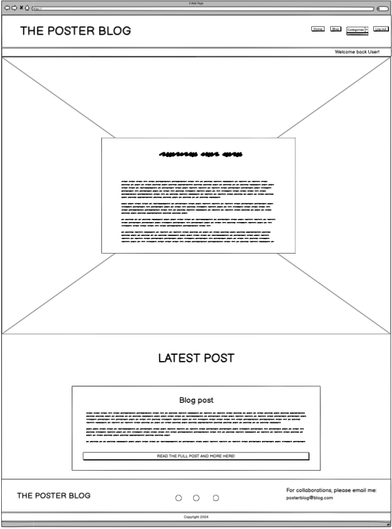

# The Poster Blog

# Introduction

Welcome to *The Poster Blog*, a vibrant space curated by Izzy, a passionate poster artist and painter. Through her blog, Izzy explores the intersection of art and daily life, offering a glimpse into her creative process, sharing personal stories, and providing valuable tips and tricks for fellow art enthusiasts.
*The Poster Blog* is more than just a blog; it's a narrative journey through the eyes of Izzy, showcasing how art can be woven into the fabric of our everyday lives. From captivating posters to mesmerizing paintings, each piece tells a story, reflecting Izzy's world and her inspiration drawn from the mundane to the magnificent.

Please note, Izzy is a fictional character created for this school project, and all content on the blog, including stories and characters, is entirely fictional.

## Table of Content

- [**The Poster Blog**](#the-poster-blog)
  - [**Introduction**](#introduction)
  - [**Table of Content**](#table-of-content)
  - [**Planning & Development**](#planning--development)
    - [**Agile Planning**](#agile-planning)
    - [**Structuring Development with User Stories**](#structuring-development-with-user-stories)
    - [**Task Breakdown and Epic Creation**](#task-breakdown-and-epic-creation)
     - [**Prioritization with MoSCoW Method**](#prioritization-with-moscw-method)
    - [**Project Goals**](#project-goals)
    - [**User Stories**](#user-stories)
      - [**As a General User**](#as-a-general-user)
      - [**As a New User**](#as-a-new-user)
    - [**Epic Breakdowns**](#epic-breakdowns)
      - [**Epic 1: Home Page Experience**](#epic-1-home-page-experience)
      - [**Epic 2: About Page Development**](#epic-2-about-page-development)
      - [**Epic 3: Login and Registration Functionality**](#epic-3-login-and-registration-functionality)
      - [**Epic 4: Blog Interaction**](#epic-4-blog-interaction)
      - [**Epic 5: Website Styling and Responsiveness**](#epic-5-website-styling-and-responsiveness)
    - [**Adaptive Development and Reflection**](#adaptive-development-and-reflection)
    - [**User-Centered Approach**](#user-centered-approach)
    - [**Database schema**](#database-schema)
    - [**Wireframes**](#wireframes)
      - [**Home Page**](#home-page)
    - [**Design Philosophy/ Features**](#design-philosophy-features)
      - [**Responsive Design**](#responsive-design)
      - [**Minimalistic Layout**](#minimalistic-layout)
      - [**Usability Enhancements**](#usability-enhancements)
      - [**Future-Proof and Scalable**](#future-proof-and-scalable)
    - [**Colors**](#colors)
    - [**Fonts**](#fonts)
    - [**Features**](#features)
    - [**Future Features**](#future-features)
  - [**Testing**](#testing)
  - [**Devtools**](#devtools)
    - [**Ligthouse**](#lighthouse)
    - [**JS Hint**](#js-hint)
  - [**Deployment**](#deployment)
  - [**Languages**](#languages)
  - [**Libraries and Installed Packages**](#libraries-and-installed-packages)
  - [**Software**](#software)
  - [**Media**](#media)
  - [**Usage**](#usage)
  - [**Modification**](#modification)
  - [**Distribution**](#distrubition)
  - [**Private Use**](#private-use)
  - [**Liability**](#liability)
  - [**Credits**](#credits)
  - [**Content**](#content)
  - [**Special thanks**](#special-thanks)
  - [**What I've learned**](#what-ive-learned)

## Planning & developmnet

## Agile Planning

The development of *The Poster Blog* was meticulously planned and executed following agile methodologies. This section outlines the user stories and epics that guided the development process, ensuring that each feature not only meets the users' expectations but also enriches their interaction with the blog.

### Structuring Development with User Stories

At the heart of my agile planning were the User Stories - the narratives that captured the essence of what the users, both general visitors and registered members, sought from *The Poster Blog*. These stories facilitated a deep understanding of the audience's needs, guiding the development process from a user-centric perspective.

### Task Breakdown and Epic Creation

Each User Story sparked a series of tasks - specific, actionable steps designed to bring that story to life. These tasks ranged from frontend design tweaks to backend functionality enhancements, each contributing to the blog's overall appeal and usability. By grouping related tasks into Epics, I could maintain a coherent development flow while keeping an eye on the bigger picture. This grouping also allowed me to tackle the blog's features systematically, ensuring that every aspect of the user experience was thoughtfully crafted and implemented.

### Prioritization with MoSCoW Method

To navigate the myriad of development tasks efficiently, I used the MoSCoW method of prioritization:

- **Must Have**: Core functionalities that were essential for the blog's launch, such as the ability to view and interact with blog posts.
- **Should Have**: Important features that enhance the user experience, like the About page that offers deeper insights into the blog's purpose and Izzy's artistic journey.
- **Could Have**: Additional features that, while not critical, could further enrich the blog, including enhanced styling and responsive design elements.
- **Won't Have (this time)**: Ideas that were put on hold for future development, allowing us to focus on the most impactful features first.

My project board can be found here: 
[Project borad](https://github.com/users/Annibor/projects/8/views/1)

- [Back to Top](#table-of-content)

### Project Goals

The primary goal of *The Poster Blog* is to inspire creativity and share knowledge. Izzy aims to:

- Share her artistic journey and the stories behind her creations.
- Provide insights into the creative process, from concept to completion.
- Offer tips and tricks for aspiring artists and art lovers.
- Creating an interactive community where users can engage with content through comments and by liking posts.
- Providing a welcoming introduction to the blog on the homepage, where visitors can sample the beginning of the latest post.

- [Back to Top](#table-of-content)

### User Stories

**As a Visitor or Registered User:**

- **Access the Home Page**: I can view a welcoming page and selected blog posts to get a taste of what the blog offers.
- **Access the About Page**: I can learn more about the blog and its creators, including their background, interests, and the vision behind the blog.
- **Access the Login/Register Page**: I can log into my existing account or register for a new account, enabling me to interact with the content more personally.
- **Access the Blog Page**: I can view previews of blog posts and engage with them through comments, deepening my connection with the content.
- **Enjoy an Appealing and Consistent Style**: I can enjoy browsing a visually engaging environment that reflects the blog's creativity and enhances my content consumption experience.

- [Back to top](#table-of-content)

#### As a General user

- Discover new art and get inspired.
- Learn about the artistic process and the life of a full-time artist.
- Follow Izzy troughout her everyday life. 

- [Back to Top](#table-of-content)

#### As a New User

- Get a welcomming introduction to the blog on the homepage,  where visitors can get a sneak peek of the latest post, encouraging deeper exploration into Izzy's world.
- Get a clear understanding that visitors need to vreate an account and be logged in in order to read the full posts, and to leave comments.

- [Back to Top](#table-of-content)

### Epic Breakdowns

**Epic 1: Home Page Experience**

- *Must Have*: Create a welcoming and informative home page.
  
**Tasks Included:**
  - Design a hero section that introduces visitors to the blog.
  - Select and display featured blog posts on the home page.

**Epic 2: About Page Development**

- *Should Have*: Offer comprehensive information about the blog and its creators.
  
**Tasks Included:**
  - Provide detailed background information about Izzy and any co-authors.
  - Outline the vision and goals of the blog.

**Epic 3: Login and Registration Functionality**

- *Must Have*: Enable users to log in or register seamlessly.
  
**Tasks Included:**
  - Implement distinct forms for login and registration processes.
  - Ensure user-friendly navigation between login and registration options.
  - Provide clear feedback for validation errors or successful account actions.

**Epic 4: Blog Interaction**

- *Should Have*: Facilitate user interaction with blog posts.
  
**Tasks Included:**
  - Display previews of blog posts with enticing summaries.
  - Include interactive comment buttons on each post preview.

**Epic 5: Website Styling and Responsiveness**

- *Could Have*: Enhance the aesthetic appeal and functionality of the website.
  
**Tasks Included:**
  - Develop a cohesive color scheme and typography style guide.
  - Style interactive elements for improved user experience.
  - Ensure responsive design for optimal viewing across devices.

  - [Back to Top](#table-of-content)

### Adaptive Development and Reflection

Embracing the agile framework, I embraced adaptability, seamlessly integrating feedback and addressing the evolving needs throughout the development of The Poster Blog. The journey began with the cornerstone elements—laying down the blog's structural foundation and establishing mechanisms for user interaction. This initial step set the stage for a broader, more nuanced expansion, allowing the blog to not merely serve as a digital platform, but to emerge as a vibrant, interactive community space that grows in tandem with its audience's engagement and artistic appreciation.

The creation of The Poster Blog, guided by the principles of agile planning, stands as a testament to the profound impact of centering user needs and embracing an iterative approach to development. This commitment to refining the user experience continues to be the driving force as I further develop this foundation, inspired by the agile ethos that has been instrumental to our progress thus far.

Throughout this process, the agile methodology—characterized by user stories and epics—served as a beacon, ensuring that each feature not only meets but exceeds user expectations. This strategic approach enabled a development trajectory that was both focused and flexible, capable of adapting to the shifting landscape of user needs and feedback.

As a result, The Poster Blog has evolved into more than a showcase of Izzy's artistic journey; it has become a thriving community hub for art lovers. Through careful planning and execution of these epics, the blog has cultivated an environment where creativity flourishes, and the collective passion for art draws users into a deeper, more meaningful engagement with the content.

- [Back to Top](#table-of-content)

### User-Centered Approach

For The Poster Blog, I've prioritize the users' experience above all. The design and development processes are deeply rooted in a user-centered approach, ensuring that the platform is not only visually appealing but also accessible, engaging, and easy to navigate. Here's how I've tailored The Poster Blog to our audience:

**Accessibility**
- Universal Design: 
I've implemented a responsive layout that adapts seamlessly across devices and screen sizes, ensuring that all users, regardless of how they access the blog, have a uniform experience.

- Accessibility Features:
From high-contrast color schemes to keyboard navigation and screen reader compatibility, I've taken steps to make The Poster Blog inclusive for users with diverse accessibility needs.

**Engagement and Interaction**
- Community Engagement: 
Users can actively participate in the artistic journey through comments, fostering a vibrant community of art enthusiasts.

- User Feedback:
We've made it easy for users to like posts, providing immediate feedback to Izzy and allowing her to gauge which topics resonate most with her audience.

**Intuitive Navigation**
- Streamlined Interface: The blog features a clean, organized layout that guides users naturally through content and minimizing distractions.

- Discoverability: 
With a clear and concise menu, users can effortlessly find content categories, blog, and more, enhancing their ability to discover new posts and topics of interest.

By placing our users at the heart of The Poster Blog's development, we strive to create an online space that not only showcases Izzy's artistic talent but also builds a supportive and engaged community around her work.

- [Back to Top](#table-of-content)

### Database schema
- **User Model (Django AllAuth)**: Serves as the central model, linking to other models like posts, comments, and likes for comprehensive user interaction within the platform.

- **Category Model**: Categorizes posts into distinct groups. Fields include a unique `name` and `slug` for URL handling. Categories help organize posts for easier navigation and discovery by users.

- **Post Model**: Represents the core content of the platform - the blog posts themselves. Each post is linked to admin (as the author) and categorized under `Category`. Essential fields include `title`, `slug`, `content`, and `status` (draft or published), facilitating rich content presentation and management.

- **Comment Model**: Enables users to engage with posts through comments. Each comment is associated with a `Post` and a `User` (author of the comment), and includes a `body`, approval status, and timestamp. Admin approval is required for comments to be visible, ensuring quality control.

- **Like Model**: Allows users to express their appreciation for posts. It prevents duplicate likes on a single post by a user through a unique together constraint on `User` and `Post`, enhancing the interactive experience of the platform.

- The platform supports full CRUD operations on posts within user-interested categories, fostering a dynamic blogging environment.
- Commenting feature enriches user engagement, with an approval mechanism in place to maintain content relevance and quality.
- Like functionality introduces a simple yet effective form of user interaction with content, promoting a more connected and interactive community.

- 

### Wireframes

I've created my wireframes for the website by using [Balsamiq](https://balsamiq.com/). I created one wireframe for mobile, tablet and desktop on each page of the website.

#### **Home page**
- 
- 
- 

- [Back to Top](#table-of-content)

#### **Blog page**
- 
- 
- 

- [Back to Top](#table-of-content)

#### **Category**
- 
- 
- 

- [Back to Top](#table-of-content)

#### **Not logged in**
- 
- 
- 

- [Back to Top](#table-of-content)

#### **Login**

- 
- 
- 

- [Back to Top](#table-of-content)

#### **Register**

- 
- 
- 

- [Back to Top](#table-of-content)

#### **Logout**

- 
- 
- 

- [Back to Top](#table-of-content)

### Design Philosophy/ Features

The design philosophy of The Poster Blog is deeply intertwined with its core mission to illuminate the art world for enthusiasts and newcomers alike. By prioritizing simplicity and accessibility, we ensure that Izzy's artwork and insights remain the focal point of every visitor's experience. Here’s an expanded overview of the design features and the thought process behind them, guided by your provided code:

- [Back to Top](#table-of-content)

#### **Responsive Design**
- Fluid Layouts:
Adapts effortlessly to any screen size, ensuring that every user enjoys a seamless browsing experience, whether on a desktop, tablet, or smartphone. This responsiveness is critical in today's diverse device landscape, allowing Izzy’s art to reach a broader audience without compromise.

- [Back to Top](#table-of-content)

#### **Minimalistic Layout**
- Clutter-Free Interface: 
Our minimalistic approach emphasizes content over decoration. By employing clean lines and a focused palette, the attention is drawn directly to Izzy's posts and artworks. This design choice reflects the belief that in simplicity, there's beauty and clarity that enhances user engagement.

- [Back to Top](#table-of-content)

#### **Usability Enhancements**
- Navigation and Accessibility: 
User-friendly navigation is a cornerstone of our design. The intuitive menu system, coupled with accessible design features, ensures that all visitors, regardless of their familiarity with technology or personal accessibility needs, can explore Izzy's blog effortlessly.

Interactive Elements: 
Through engaging UI components like comment buttons, like icons, and social media links, we encourage visitors to interact with the content. These features are designed to foster a community around Izzy’s work, allowing her insights and creations to spark conversations and connections.

- [Back to Top](#table-of-content)

#### **Future-Proof and Scalable**
- Built to Evolve: 
The architecture behind The Poster Blog is not just about meeting today's needs but anticipating tomorrow's growth. As Izzy’s career expands and her audience grows, the site is ready to scale, introducing new features and content without losing the essence of its design philosophy.
In essence, the design of The Poster Blog is a thoughtful blend of aesthetics, functionality, and user experience principles. It serves as a digital canvas that beautifully showcases Izzy’s artistry while ensuring every visitor feels welcomed, inspired, and eager to engage.

- [Back to Top](#table-of-content)

### Fonts
**Typography and Colors**
- Harmonious Typography:
The chosen fonts, such as Inter, Lato, and Montserrat, offer a balance between artistic flair and readability. Each font weight and size is meticulously selected to guide the reader's eye through the content, enhancing comprehension without sacrificing aesthetic appeal.
They are also chosen to make sure the fokus is drawn to Izzy´s blog posts.

- [Back to Top](#table-of-content)

### Colors
- Palette Choices:
The color scheme, featuring a warm mix of #c1666b, #a25058, and #fedd97, complements Izzy's vibrant artwork adn life and creates an inviting atmosphere. These colors are not just background elements but integral parts of the storytelling process, evoking emotions and setting the mood for each post.

- [Back to Top](#table-of-content)

### Features

- **Header**:
- 
- 
- 
- 

- **Footer**:
- 
- 
- 

- **Homepage**:

- 
- 

- 
- 

- 
- 

- **Blog page**:

- 
- 
- 

- 

- *Pages & Arrows Blog Page*:
- 

- **Category Page**:
- 
- 
- 

- **Login Page**:
- 

- **Register Page**:
- 

- **Logout Page**:
- 
- 

- **Comments**:
- 
- 
- 
- 
- 

- [Back to Top](#table-of-content)

### Future Features

Planned enhancements for the website to further enrich user experience include:

**Search Functionality**
- *User Story*: As a reader, I want to search for blog posts using keywords so that I can easily find content that matches my interests.
- *Acceptance Criteria*:
 - Users can enter keywords into a search bar to find blog posts.
 - Search results display posts with relevant titles and excerpts.
 - Users can navigate from the search results to the full blog post.

**Save Posts for Later**
- **User Story**: As a registered user, I want to save blog posts to my profile so that I can easily access my favorite content at any time.
- Acceptance Criteria:
 - Users can save posts with a single click while reading.
 - Saved posts are listed in the user's profile for future reference.
 - Users can remove posts from their saved list.

**Enhanced User Profile Management**
- *User Story*: As a registered user, I want to view and edit my profile details so that I can keep my personal information up to date.
- *Acceptance Criteria*:
 - Users can access and edit their username, email, and profile picture from their profile page.
 - Updates to the profile are saved and immediately reflected in the user's account.
 - Users receive feedback upon successfully updating their profile details.

**About Page for Blog and Creators**
- *User Story*: As a visitor, I want to access an About page so that I can learn more about the blog and its creators.
- *Acceptance Criteria*:
 - The About page includes information about the blog's mission, the creators, and their backgrounds.
 - The page highlights the unique aspects and values of the blog.
 - Visitors find contact information or ways to connect with the creators.

These features aim to enhance user engagement and provide a more personalized experience on the blog. Implementation will be prioritized based on user feedback and resource availability.

- [Back to Top](#table-of-content)

## Testing

- Throughout the whole development of the webpage, I've made tests in:

### Wc3

- Homepage
- [Homepage 1](/documentation/testingimages/wc3-home-1.png)
- [Homepage 2](/documentation/testingimages/wc3-home-2.png)

- Blog page
- [Blog page 1](/documentation/testingimages/wc3-blog-1.png)
- [Blog page 2](/documentation/testingimages/wc3-blog-2.png)

- Category page
- [Category page 1](/documentation/testingimages/wc3-category-1.png)
- [Category page 2](/documentation/testingimages/wc3-category-2.png) 

- Login page
-[Login page](/documentation/testingimages/wc3-login.png)

- Logout page
- [Logout page 1](/documentation/testingimages/wc3-logout-1.png)
- [Logout page 2](/documentation/testingimages/wc3-logout-2.png)

- Signup page
- [Signup page 1](/documentation/testingimages/wc3-signup-1.png)
- [Signup page 2](/documentation/testingimages/wc3-signup-2.png)

- [Back to Top](#table-of-content)

### DevTools

- Troughout the development I've used Devtools to inspect and test the website to be able to make the best I could for it.

- [Back to Top](#table-of-content)

### Lighthouse

- 
- 

- 
- 

- 
- 

- 
- 

- 
- 

- 
- 

- [Back to Top](#table-of-content)

### JS HINT

- JSHint test for Javascript code.

- 

- [Back to Top](#table-of-content)

### CI Python Linter

- CI Python Linter tests are all okey

- [CI Python Linter admin](/documentation/testingimages/linter-blog-admin.png)
- [Ci Python Linter form](/documentation/testingimages/linter-blog-form.png)
- [CI Python Linter models](/documentation/testingimages/linter-blog-models.png)
- [CI Python Linter views](/documentation/testingimages/linter-blog-views.png)

### Manual testing

I tested the website manualy throughout the whole developing progress. The website is tested in Safari, Google Chrome and Brave. The website is also tested from an Iphone.

- [Back to Top](#table-of-content)

#### Manual testing

<table>
  <thead>
   <tr>
     <th>Testing Description</th>
     <th>Expected Action</th>
     <th>Actual Output</th>
     <th>Result</th>
   </tr>
 </thead>
  <tbody>
  <tr>
     <th>Responsive navbar</th>
     <th>Navbar changes from humburger menu into a horizontal list when changing screen sizes</th>
     <th>As expected</th>
     <th>Pass</th>
   </tr>
  <tr>
     <td>Navlinks works.</td>
     <td>Navbar opens each link correct.</td>
     <th>As expected</th>
     <th>Pass</th>
   </tr>
   <tr>
     <td>Fontsize rezies for larger screens.</td>
     <td>The font-sizes changes for better UX dependign on screensize.</td>
     <th>As expected</th>
     <th>Pass</th>
   </tr>
   <tr>
     <td>Images rezies for larger screens.</td>
     <td>Images rezies for larger screens.</td>
     <th>As expected</th>
     <th>Pass</th>
   </tr>
    <tr>
     <td>Layout for posts changes depending on screenssize.</td>
     <td>Images renders over text on smaller screens and moves to the left of the text on desktops.</td>
     <th>As expected</th>
     <th>Pass</th>
   </tr>
    <tr>
     <td>Messages are displayed for user logged in status.</td>
     <td>Message of not logged in or welcome back user-name is shown.</td>
     <th>As expected</th>
     <th>Pass</th>
   </tr>
    <tr>
     <td>Instagram link in footer works.</td>
     <td>Link works and open Instagram when clicked.</td>
     <th>As expected</th>
     <th>Pass</th>
   </tr>
    <tr>
     <td>Facebook link in footer works.</td>
     <td>Link works and open Facebook when clicked.</td>
     <th>As expected</th>
     <th>Pass</th>
   </tr>
   <tr>
     <td>Visitor can register on website.</td>
     <td>Visitors can register on the website correctly.</td>
     <th>As expected</th>
     <th>Pass</th>
   </tr>
   <tr>
     <td>Users can login from login page.</td>
     <td>Users can login from login page.</td>
     <th>As expected</th>
     <th>Pass</th>
   </tr>
   <tr>
     <td>Remember me checkbox works.</td>
     <td>Users can use remember me checkbox for fast login.</td>
     <th>As expected</th>
     <th>Pass</th>
   </tr>
   <tr>
     <td>Logout works.</td>
     <td>Users can logout correclty and gets confirmation button to click before getting logged out.</td>
     <th>As expected</th>
     <th>Pass</th>
   </tr>
   <tr>
     <td>Comment button works.</td>
     <td>Comment button opens modal that shows comments for the post.</td>
     <th>As expected</th>
     <th>Pass</th>
   </tr>
   <tr>
     <td>Users can create comments.</td>
     <td>Only logged in users can create comments.</td>
     <th>As expected</th>
     <th>Pass</th>
   </tr>
   <tr>
     <td>New comments awaiting approval.</td>
     <td>New comments only renders for the writer, until admin have accepted that the comment is okey.</td>
     <th>As expected</th>
     <th>Pass</th>
   </tr>
   <tr>
     <td>Accepted comments shows in modal.</td>
     <td>Commments admin ahve accepted renders in modal.</td>
     <th>As expected</th>
     <th>Pass</th>
   </tr>
   <tr>
     <td>Read full blogpost on home page works.</td>
     <td>The button redirect user to blog page</td>
     <th>As expected</th>
     <th>Pass</th>
   </tr>
   <tr>
     <td>Category pages works as expected.</td>
     <td>Different categorys only renders the connected blogposts.</td>
     <th>As expected</th>
     <th>Pass</th>
   </tr>
   <tr>
     <td>Login to leave a comment link works.</td>
     <td>Login to leave a comment link redirects user to login page.</td>
     <th>As expected</th>
     <th>Pass</th>
   </tr>
   <tr>
     <td>Signup link from login page works.</td>
     <td>Signup link from login page redirects user to register page.</td>
     <th>As expected</th>
     <th>Pass</th>
   </tr>
   <tr>
     <td>Must agree to terms when register new user.</td>
     <td>Must agree to terms when register a new user, or else get message saying you need to accepte before continuing.</td>
     <th>As expected</th>
     <th>Pass</th>
   </tr>
   <tr>
     <td>Sigin link from register page works.</td>
     <td>Signin link from register page redirects user to login page.</td>
     <th>As expected</th>
     <th>Pass</th>
   </tr>
   <tr>
     <td>Navitems changes color when hoovered over.</td>
     <td>Navitems changes color when hoovered over.</td>
     <th>As expected</th>
     <th>Pass</th>
   </tr>
   <tr>
     <td>Navlinks gets larger when clicked on.</td>
     <td>Navlinks gets larger when clicked on.</td>
     <th>As expected</th>
     <th>Pass</th>
   </tr>
   <tr>
     <td>Message of comments awaiting approval shows.</td>
     <td>Message of comments awaiting approval shows.</td>
     <th>As expected</th>
     <th>Pass</th>
   </tr>
   <tr>
     <td>Message of comments awaiting approval can be deleted by clicking X.</td>
     <td>User can delete message of comments awaiting approval by clicking X.</td>
     <th>As expected</th>
     <th>Pass</th>
   </tr>
   <tr>
     <td>Edit button for commetns works.</td>
     <td>Edit button for commetns works, and only on the comments the user have been writeing self.</td>
     <th>As expected</th>
     <th>Pass</th>
   </tr>
   <tr>
     <td>Delete button works.</td>
     <td>Delete button works only for the user that have been writing it, and are you sure message shows. User needs to confirm the deletion and then the comment will be delted.</td>
     <th>As expected</th>
     <th>Pass</th>
   </tr>
   <tr>
     <td>Closing modal button works.</td>
     <td>Closing buttons in modal closes it when clicked.</td>
     <th>As expected</th>
     <th>Pass</th>
   </tr>
   <tr>
     <td>Like button works.</td>
     <td>Registered useres can like blogposts.</td>
     <th>As expected</th>
     <th>Pass</th>
   </tr>
   <tr>
     <td>The number of comments shows</td>
     <td>The number of comments shows - and only the ones that are accepted by admin..</td>
     <th>As expected</th>
     <th>Pass</th>
   </tr>
   <tr>
     <td>The number of likes shows.</td>
     <td>The number of likes shows.</td>
     <th>As expected</th>
     <th>Pass</th>
   </tr>
   <tr>
     <td>Category shows, and link works.</td>
     <td>The category shows adn redirtect user to the specific category page when clicked.</td>
     <th>As expected</th>
     <th>Pass</th>
   </tr>
   <tr>
     <td>Date when publiched post works.</td>
     <td>Date when publiched post works.</td>
     <th>As expected</th>
     <th>Pass</th>
   </tr>
   <tr>
     <td>Pagination buttons work.</td>
     <td>Pagination buttons works.</td>
     <th>As expected</th>
     <th>Pass</th>
   </tr>
   <tr>
     <td>Logo link i n footer work.</td>
     <td>Logo link in footer redirects user to starting page.</td>
     <th>As expected</th>
     <th>Pass</th>
   </tr><tr>
     <td>Save button for edit comments works.</td>
     <td>Save button saves the edited comment and update it.</td>
     <th>As expected</th>
     <th>Pass</th>
   </tr>
  </tbody>
</table>

- [Back to Top](#table-of-content)

## Deployment

This section guides you through the deployment of an project on Heroku, including handling different branches and deployment preferences.

### Preparing for Deployment

Ensure your project includes a `requirements.txt` and a `Procfile`, which are essential for Heroku to understand how to run your application.

1. **requirements.txt**: Generate this file using `pip freeze > requirements.txt` to list all necessary Python packages.
2. **Procfile**: Create this file in your project's root directory with the content: `web: gunicorn your_project_name.wsgi`, replacing `your_project_name` with the name of your Django project.

### Deploying to Heroku

1. **Create a Heroku Account**: Sign up at [Heroku's website](https://signup.heroku.com/).
2. **Create a Heroku App**: Use `heroku create your-app-name`, substituting `your-app-name` with your desired app name.
3. **Set Config Vars**: Navigate to your app's settings on the Heroku dashboard, under "Config Vars", set:
    - `SECRET_KEY`: Your Django secret key.
    - `DATABASE_URL`: The database URL, typically provided by Heroku Postgres.
    - `CLOUDINARY_URL`: If using Cloudinary for media storage, your Cloudinary URL.

### Managing Branches and Deployment Options

1. **Branch Management**: If your development involves multiple branches, Heroku deploys from the main branch by default. To deploy from a different branch, use `git push heroku your-branch-name:main`, replacing `your-branch-name` with the name of your branch.

2. **Automatic vs. Manual Deployment**:
   - **Automatic Deployment**: In the Heroku dashboard, under the "Deploy" tab, you can connect your GitHub repository and enable automatic deploys from your chosen branch. This means any push to the selected branch automatically triggers a deployment.
   - **Manual Deployment**: If you prefer more control over when your changes go live, stick with manual deployments using the `git push heroku main` command for the main branch, or the appropriate branch name if deploying from a non-main branch.

3. **Deployment Preference**: You can switch between automatic and manual deployments based on your project's needs. For instance, automatic deployments are convenient for continuous delivery environments, while manual deployments offer more control for testing and final approvals before going live.

### Final Steps

1. **Run Migrations**: Execute `python3 manage.py makemigrations` `python3 manage.py migrate` to apply database migrations.
2. **Access Your App**: Open your app in a browser with `heroku open` or by visiting `https://your-app-name.herokuapp.com`.

### Forking and Cloning (Optional)

- **Forking**: Click 'Fork' on the GitHub repository page to copy the project under your account.
- **Cloning**: Use `git clone copied-url` with the URL from the 'Code' button on GitHub to clone the repository for local development.

My link is: 

- [Back to Top](#table-of-content)

## Languages

- Python and the Django framework were used for backend development, data manipulation, and application logic.

- HTML was utilized to structure the content on web pages.

- CSS was employed for styling, including layout designs, colors, and fonts, to enhance the user interface.

- JavaScript may have been used to add interactive elements to the web pages, in conjunction with libraries or frameworks like Bootstrap for responsive design.

- SQL, through Django models, facilitated database management and operations, handling data storage, retrieval, and manipulation.

- Django Template Language enabled dynamic data insertion into HTML, allowing for a seamless integration of backend and frontend elements.

This project showcases a full-stack web development approach, leveraging the strengths of each technology to create a comprehensive and interactive web application.

- [Back to Top](#table-of-content)

## Libraries and Installed Packages

- Cloudinary: A cloud-based service for hosting videos and images. Used in conjunction with dj3-cloudinary-storage for managing static and media files in the cloud.
- crispy-bootstrap5: An extension of django-crispy-forms specifically for Bootstrap 5.
- django-allauth: Provides authentication, registration, account management, and third-party (social) account authentication.
- django-crispy-forms: Django application that lets you easily build, customize and reuse forms using your favorite CSS framework.
- django-summernote: A Django app that integrates the Summernote editor with Django. Useful for adding a rich text editor to your blog.
- dj-database-url: Utility to configure your Django application's database using the `DATABASE_URL` environment variable.
- dj3-cloudinary-storage: For integrating Cloudinary's cloud storage solutions with your Django application.
- gunicorn: A Python WSGI HTTP Server for UNIX, used for deploying Python applications.
- psycopg2: PostgreSQL adapter for Python.
- whitenoise: Allows your web application to serve its own static files, making it easier to deploy Django apps on platforms like Heroku.

- [Back to Top](#table-of-content)

## Software

- I've used Visual Studio Code to write the code.
- I've used Git to load and push my code to Github and for version control.
- I've used GitHub for repository management.
- I've used preinstalled app called "Preview" to edit the sizes of the photos.
- I've used Coolors.co to find a color palette for the website.
- I've also used Coolors.co to contrast check text colors and background colors.
- I've used maketintsandshades.com to find evetuals tints and shadow colors as a complement for the color palette.
- I've used Balsamiq when I made the wireframes for the website.
- I've used cssgradient.io to make the background gradient.
- I've used Chat GPT and google translate for some translations and questions.

- [Back to Top](#table-of-content)

## Media

- I've used Chat GPT for making images that would fit the project.
- I've used unsplash for images.

- [Back to Top](#table-of-content)

## Usage

- This project is available for viewing and can be used for educational purposes.

- [Back to Top](#table-of-content)

## Modification

- Any modification, transformation, or extension of this project for commercial or public purposes is not allowed without explicit permission.

- [Back to Top](#table-of-content)

## Distrubition

- The redistribution of this project, wheter in its original form or with modifications, is sricktly prohibited without prior consent.

- [Back to Top](#table-of-content)

## Private Use

- Feel free to use this project for private purposes, sush as personal reference or study.

- [Back to Top](#table-of-content)

## Liability

- The creator of this project shall not be held liable for any adverse outcomes or damages resulting from the use or misapplication of this project. Users are advised to exercise due care and discretion when utilizing the project's resources and functionalities.

- [Back to Top](#table-of-content)

## Credits

### Content

- This README is based upon three sourses for guidance: one by Davis Calikes, available at [GitHub](https://github.com/davidcalikes/portfolio-project-one#readme), one by Victoria Traynor, avaliable at [Github](https://github.com/VictoriaT87/P4-Aventine-Wellness/blob/main/README.md), and another authored by me, available at [GitHub](https://github.com/Annibor/EarthEcho-Studios/blob/main/README.md)
- Usage, Modification, Distrubition, Private Use and Liability Content: The guidelines pertaining to usage, modification, distribution, private use, and liability are directly derived from my project, accessible at [GitHub](https://github.com/Annibor/EarthEcho-Studios/blob/main/README.md)

- [Back to Top](#table-of-content)

### General Credits
- [MDBootstrap comments](https://mdbootstrap.com/docs/standard/extended/comments/)
- [Get Bootstrap modal](https://getbootstrap.com/docs/5.2/components/modal/)
- [Get Bootstrap navbar dropdown](https://getbootstrap.com/docs/5.2/components/dropdowns/#headers)
- [Get Bootstrap navbar ](https://getbootstrap.com/docs/5.2/components/navbar/)
- [Costume Signup Form Allauth](https://docs.allauth.org/en/latest/account/forms.html)

- [Back to Top](#table-of-content)

### Special Thanks

I would like to express my gratitude to the following individuals who have made a meaningful impact on this project:

- **Michel**: My wonderful boyfriend, whose unwavering support and encouragement have been my constant motivation.
- [Back to Top](#table-of-content)

## What I've Learned

In developing this project, I've embarked on a journey that was both challenging and immensely rewarding. Here are some reflections on what I've learned along the way:

- **Problems**:
I had a lot of problems with changes that I made in the code came back after som git commits. Here I will show an example of code that I deleted, and after some git commits tha code was back, and I had to delete it again:
- [Changed Code Back](/documentation/otherimages/changed-code-back.png)
- [Changed Code Back 2](/documentation/otherimages/changed-code-back-2.png)
- [Changed Code Back 3](/documentation/otherimages/changed-code-back-3.png)

- **Adaptability in Problem-Solving**: I encountered numerous challenges, from bugs in the code to design hurdles. Each issue required a unique solution, teaching me the importance of adaptability and perseverance. It was a reminder that problem-solving is a dynamic process that often requires thinking outside the box.

- **Depth of Django and Python**: This project deepened my understanding of Django and Python, particularly in how they can be leveraged to create robust web applications. I've gained a greater appreciation for Django's ORM, class-based views, and the powerful templating system, which together make it easier to build and manage dynamic content.

- **The Importance of User-Centric Design**: Throughout the development, the focus remained on creating an intuitive and accessible user experience. This project reinforced the principle that design should always prioritize the needs and preferences of the user. It's not just about aesthetic appeal but about creating interfaces that are logical, navigable, and inclusive.

- **Agile Development Practices**: Implementing agile methodologies, such as breaking down the project into smaller, manageable epics and user stories, was instrumental in maintaining focus and efficiency. It highlighted the value of flexibility in the development process and the need for continuous iteration based on feedback.

- **The Joy of Learning**: Above all, this project has been a testament to the joy of learning. Each obstacle overcome and each functionality successfully implemented was a reminder of why I love coding: the constant cycle of learning, creating, and improving is deeply fulfilling.

- **Early Testing with W3C Validation**: One crucial strategy I learned was the importance of conducting early and frequent tests with W3C validators. This approach helped identify and rectify markup errors and compatibility issues sooner, minimizing potential headaches down the line. It underscored the value of integrating best practices and standards compliance from the start of the development process, ensuring a more stable and accessible end product.

As I reflect on this project, I'm grateful for the opportunities it has provided to grow as a developer. The lessons learned extend beyond technical skills; they encompass the softer skills of patience, resilience, and creative thinking, which are equally valuable in this ever-evolving field.

- [Back to Top](#table-of-content)
